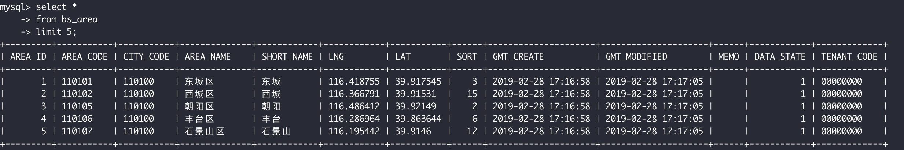
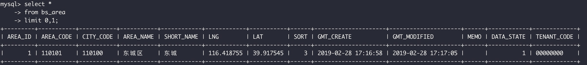
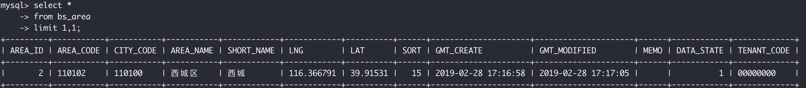

### 使用MySQL

- 连接:为了连接到MySQL，需要以下信息:
  - 主机名:若连接到本地则为localhost
  - 端口:如果使用默认**端口3306**之外的端口
  - 一个合法的用户名
  - 用户口令（如果需要）
- SQL语句**不区分大小写**
- 连接数据库:使用`USE`关键字选择数据库
```sql
USE course; /*输出Database changed*/
```
- 了解数据库和表:
  - `show databases;`指令返回可用数据库的一个列表.
  - `show tables`指令获得一个数据库内的表的列表.
  - `show columns from 表名`指令要求给出一个表名，它对每个字段返回一行，每行包含该字段的详细信息。
  - `help show`指令显示允许的SHOW语句。

### 检索数据
- 检索列，检索所有列可以使用通配符`*`
```sql
select 列名1,列名2,...
from 表名;

/*检索所有列*/
select *
from 表名;
```
- 检索时使用关键字`DISTINCT`,将返回不同的行
```sql
select distinct vend_id
from products;
```
- 使用关键字`limit`限定要检索的开始行和行数
```sql
select prod_name
from products
limit 5; /*取前5行*/

select prod_name
from products
limit 5,5;  /*从行5开始，取5行（不包括行5）*/
```




### 排序检索数据
- 当`SELECT`语句检索数据时可以使用`ORDER BY`子句对结果排序.通常`ORDER BY`子句中使用的列将是为显示所选择的列，但实际上用非检索的列排序也是完全合法的。
```sql
select prod_name
from products
order by prod_name; /*默认升序*/

select prod_id,prod_price,prod_name
from products
order by prod_price,prod_name;  /*指定按多个列排序，排序完全按所规定的顺序进行*/

select prod_id,prod_price,prod_name
from products
order by prod_price desc; /*使用关键字desc降序排序*/

select prod_id,prod_price,prod_name
from products
order by prod_price desc,prod_name; /*desc关键字只应用到直接位于其前面的列名，所以先按prod_price列降序排序，之后若prod_price相同则按prod_name升序排序*/
```

