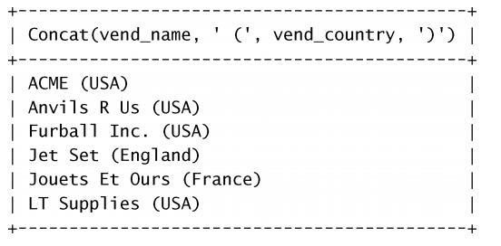
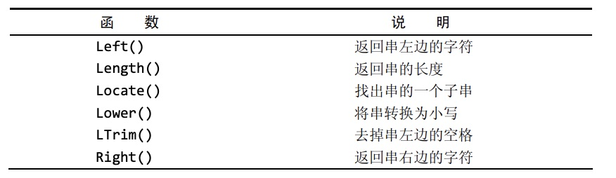
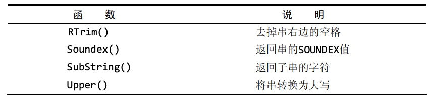
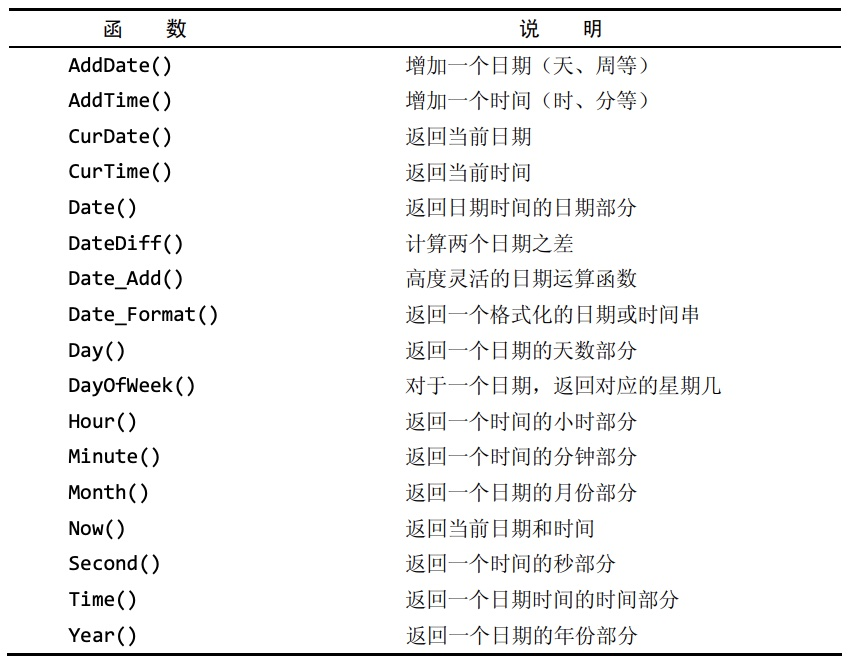
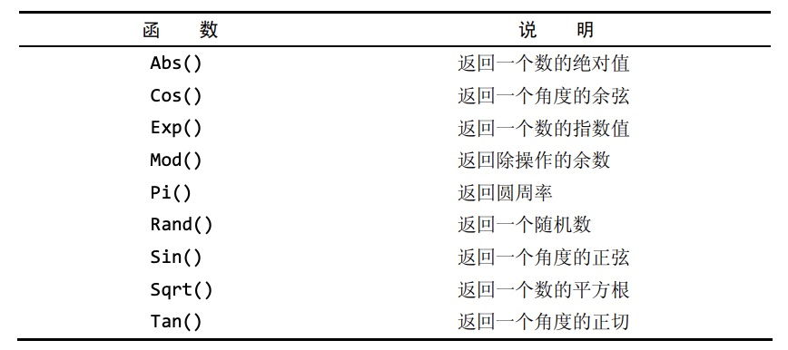

### 创建计算字段

- 在MYSQL的`SELECT`语句中，可使用`Concat()`函数来拼接两个列
```sql
select Concat(vend_name,'(',vend_country,')')
from vendors
order by vend_name;
```

- `RTrim()`函数去掉值右边的所有空格，`LTrim()`函数去掉值左边的所有空格，`Trim()`函数去掉左右两边的空格。
```sql
select Concat(RTrim(vend_name),'(',RTrim(vend_country),')')
from vendors
order by bend_name;
```

### 使用别名

- SQL支持列别名，别名用`AS`关键字.
```sql
select Concat(RTrim(vend_name),'(',RTrim(vend_country),')') as vend_title
from vendors
order by vend_name;
```

### 执行算术计算

- 在`SELECT`语句中可以执行算术运算。
```sql
select prod_id,
        quantity,
        item_price,
        quantity*item_price as expanded_price  /*新计算的列定义别名*/
from orderitems
where order_num=20005;
```

### 使用数据处理函数

- 大多数SQL实现支持以下类型的函数:
  - 用于处理文本串
  - 用于在数值数据上进行算术操作
  - 用于处理日期和时间值并从这些值中提取特定成分的日期和时间函数
  - 返回DBMS正使用的特殊信息（如返回用户登录信息吗，检测版本细节）的系统函数
- 常用文本处理函数如下:


- 常用日期和时间处理函数如下:

```sql
/*查找order_date为2005年9月的所有数据*/
select cust_id,order_num
from orders
where Year(order_date)=2005 and Month(order_date)=9;
```
- 常见数值处理函数如下:


