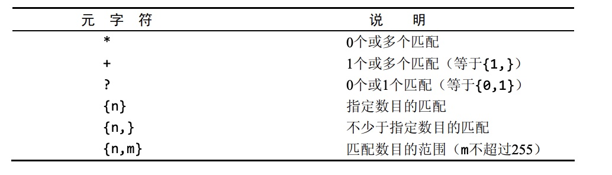
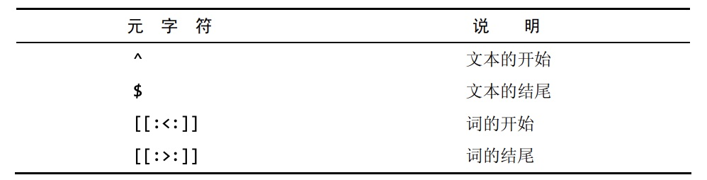

### 过滤数据

- 在`select`语句中，数据根据`where`子句中指定的搜索条件进行过滤，`where`子句在表名之后给出。
```sql
select prod_name,prod_price
from products
where prod_price=2.50;
```
- 在同时使用`order by`和`where`子句时，应该让`order by`位于`where`之后，否则将会产生错误。
- mysql支持的所有条件操作符如下图:

```sql
select prod_name,prod_price
from products
where prod_price between 5 and 10;
```
- 空值检查
  - 在一个列不包含值时，称其为包含空值`NULL`
  - `NULL`，它与字段包含0、空字符串或仅仅包含空格不同。
  - `select`语句可以用个`where`子句中的`is null`来检查具有`NULL`值的行。
  - **在匹配过滤或不匹配过滤时，不会返回具有`NULL`值的行。**
```sql
select prod_name
from products
where prod_price is null;/*返回所有prod_prices字段为NULL的行*/
```
- 在`where`子句中可以通过逻辑操作符`and`和`or`进行更加复杂的过滤，其中`and`的优先级高于`or`,为了避免出错，建议使用圆括号明确地分组相应的操作符。
```sql
select prod_name,prod_price
from products
where (vend_id=1002 or vend_id=1003) and prod_price>=10;
```
- 在`where`语句中通过`in`操作符用来指定条件范围，范围中的每个条件都可以进行匹配，其功能与`or`相当。`not in`排除指定条件范围内的数据行。
  - mysql支持使用`not`对`in`,`between`和`exists`子句取反。
```sql
select prod_name,prod_price
from products
where vend_id in (1002,1003)
order by prod_name;

select prod_name,prod_price
from products
where vend_id not in (1002,1003)
order by prod_name;
```

### 用通配符进行过滤

- 使用`LIKE`操作符进行模糊查找，根据Mysql的配置方式，搜索可以是区分大小写的:百分号`%`通配符表示任何字符出现任意次数;下滑性`_`通配符匹配任意单个字符。
```sql
select prod_id,prod_name
from products
where prod_name like 'jet%';

select prod_name
from products
where prod_name like 's%%e';  /*找出以s起头e结尾的所有产品*/
```
- MYSQL的通配符搜索的处理所花时间较长，所以不要过度使用通配符。

### 用正则表达式进行搜索

- MYSQL中使用`REGEXP`,`REGEXP`与`LIKE`的区别是`REGEXP`在列值内进行匹配，不要求从头匹配，只要文本中出现了要匹配的文本就会被返回
- MYSQL的正则表达式匹配不区分大小写，为区分大小写要使用`BINARY`关键字。
```sql
select *
from products
where prod_name regexp binary 'JetPack .000';
```
- MYSQL中正则匹配的规则:
  - `.`表示匹配任意一个字符
  - `|`表示搜索两个串之一
  - `[...]`表示匹配'['和']'括起来的字符之一，比如`[123]`代价于`[1| 2| 3]`;`[^...]`表示匹配除这些字符外的任何东西;`[0-9]`匹配`0~9`范围的数字，`[a-z]`同理
  - 前面提到的`.`,`|`等都是特殊字符，如果要匹配特殊字符，则必须用`\\`为前导
  - 匹配多个实例的语法如下图:

  - 为了匹配特定位置的文本，可以使用下图所示的定位符

```sql
select prod_name
from products
where prod_name regexp '1000|2000'
order by prod_name;

select prod_name
from products
where prod_name regexp '[123] Ton'
order by prod_name;

select vend_name
from vendors
where vend_name regexp '\\.'
order by bend_name;

/*\\转义(和),[0-9]匹配任意数字，sticks?匹配stick和sticks（s后的?使s可选）*/
select prod_name
from products
where prod_name regexp '\\([0-9] sticks?\\)'
order by prod_name;
```

