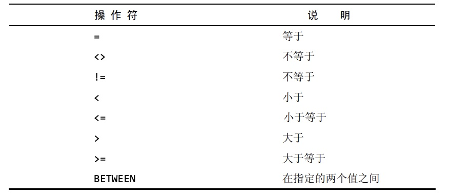

### 过滤数据

- 在`select`语句中，数据根据`where`子句中指定的搜索条件进行过滤，`where`子句在表名之后给出。
```sql
select prod_name,prod_price
from products
where prod_price=2.50;
```
- 在同时使用`order by`和`where`子句时，应该让`order by`位于`where`之后，否则将会产生错误。
- mysql支持的所有条件操作符如下图:

```sql
select prod_name,prod_price
from products
where prod_price between 5 and 10;
```
- 空值检查
  - 在一个列不包含值时，称其为包含空值`NULL`
  - `NULL`，它与字段包含0、空字符串或仅仅包含空格不同。
  - `select`语句可以用个`where`子句中的`is null`来检查具有`NULL`值的行。
  - **在匹配过滤或不匹配过滤时，不会返回具有`NULL`值的行。**
```sql
select prod_name
from products
where prod_price is null;/*返回所有prod_prices字段为NULL的行*/
```
- 在`where`子句中可以通过逻辑操作符`and`和`or`进行更加复杂的过滤，其中`and`的优先级高于`or`,为了避免出错，建议使用圆括号明确地分组相应的操作符。
```sql
select prod_name,prod_price
from products
where (vend_id=1002 or vend_id=1003) and prod_price>=10;
```
- 在`where`语句中通过`in`操作符用来指定条件范围，范围中的每个条件都可以进行匹配，其功能与`or`相当。`not in`排除指定条件范围内的数据行。
  - mysql支持使用`not`对`in`,`between`和`exists`子句取反。
```sql
select prod_name,prod_price
from products
where vend_id in (1002,1003)
order by prod_name;

select prod_name,prod_price
from products
where vend_id not in (1002,1003)
order by prod_name;
```


