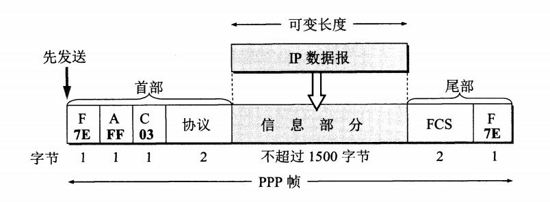

### 数据链路层

数据链路层使用的信道主要有以下两种类型：
- 点对点信道
- 广播信道

数据链路层的三个基本问题：
- 封装成帧：给一段数据的前后分别添加首部和尾部，构成一个数据帧。
- 透明传输：转义字符的引入，用于解决控制字符出现在数据中的问题。
- 差错检测：数据链路层广泛使用循环冗余检验CRC。

- **数据链路层不提供“可靠传输”的服务。**
- “可靠传输”是指传输过程中不出现传输差错，传输差错可以分为:
  - 比特差错
  - 帧丢失、帧重复、帧失序
- 使用CRC只能检测出比特差错。

### 点对点协议PPP

对于点对点的链路，点对点协议PPP(Point-to-Point Protocol)则是目前使用得最广泛的数据链路层协议。

- PPP协议有三个组成部分：
  - 一个将IP数据报封装到串行链路的方法。这个部分的长度受最大传送单元MTU的限制。
  - 一个用来建立、配置和测试数据链路连接的**链路控制协议LCP(Link Control Protocol)**。
  - 一套网络控制协议NCP(Network Control Protocol),其中的每一个协议支持不同的网络协议。

#### PPP协议的帧格式

- 各字段意义:
  - 首部和尾部开始介素标志符`7E`.
  - A和C没有实际意义。
  - 协议字段为`0x0021`时表示信息部分是IP数据报；协议字段为`0xC021`时，表示信息部分是PPP链路控制协议LCP的数据;为`0x8021`表示是网络层的控制数据。
  - 信息字段的长度是可变的，不超过1500字节。
  - FCS是用于CRC的帧检验序列。

