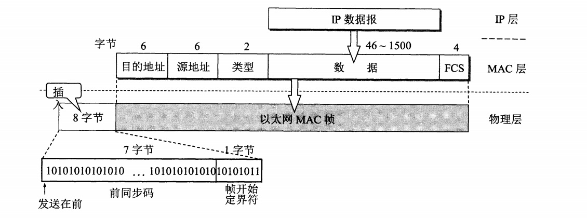
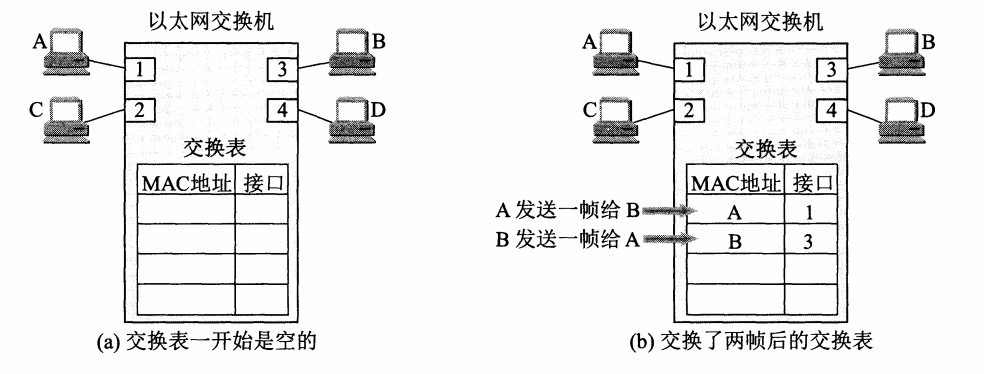

### 数据链路层

数据链路层使用的信道主要有以下两种类型：
- 点对点信道
- 广播信道

数据链路层的三个基本问题：
- 封装成帧：给一段数据的前后分别添加首部和尾部，构成一个数据帧。
- 透明传输：转义字符的引入，用于解决控制字符出现在数据中的问题。
- 差错检测：数据链路层广泛使用循环冗余检验CRC。

- **数据链路层不提供“可靠传输”的服务。**
- “可靠传输”是指传输过程中不出现传输差错，传输差错可以分为:
  - 比特差错
  - 帧丢失、帧重复、帧失序
- 使用CRC只能检测出比特差错。

### 点对点协议PPP

对于点对点的链路，点对点协议PPP(Point-to-Point Protocol)则是目前使用得最广泛的数据链路层协议。

- PPP协议有三个组成部分：
  - 一个将IP数据报封装到串行链路的方法。这个部分的长度受最大传送单元MTU的限制。
  - 一个用来建立、配置和测试数据链路连接的**链路控制协议LCP(Link Control Protocol)**。
  - 一套网络控制协议NCP(Network Control Protocol),其中的每一个协议支持不同的网络协议。

#### PPP协议的帧格式

- 各字段意义:
  - 首部和尾部开始介素标志符`7E`.
  - A和C没有实际意义。
  - 协议字段为`0x0021`时表示信息部分是IP数据报；协议字段为`0xC021`时，表示信息部分是PPP链路控制协议LCP的数据;为`0x8021`表示是网络层的控制数据。
  - 信息字段的长度是可变的，不超过1500字节。
  - FCS是用于CRC的帧检验序列。
- 透明传输:
  - 当PPP协议用于异步传输(逐个字符地传送)时，使用**字节填充**处理信息字段出现标志字段的问题。
  - 当PPP协议用于同步传输(一连串的比特连续传送)时，使用**零比特填充**处理信息字段出现标志字段的问题。

### 局域网
- 计算机与外界局域网的连接是通过通信**适配器**进行的。
  - 计算机的硬件地址就在适配器的ROM中，而计算机的软件地址Ip地址则在计算机的存储器中。

- 传统以太网将多台计算机连接到一根总线上，**在同一时间只能运行一台计算机发送数据**，通过**CSMA/CD协议**来协调各计算机。
- 为了通信的简便，以太网采用了两种措施:
  - 采用较为灵活的**无连接**的工作方式，即不必先建立连接就可以直接发送数据。
  - 以太网发送的数据都使用**曼彻斯特(Manchester)编码**的信号。
- CSMA/CD协议:意思是载波监听多点接入/碰撞检测(Carrier Sense Multiple Access with Collision Detection)。
  - **多点接入**就是说明这是总线型网络，许多计算机以多点接入的方式连接在一根总线上。协议的实质是“载波监听”和“碰撞检测”。
  - **载波监听**就是用电子技术检测总线上有没有其他计算机也在发送。不管在**发送前**，还是在**发送中**，**每个站都必须不停地检测信道**。
  - **碰撞检测**也就是“边发送边监听”，当几个站同时在总线上发送数据时，总线上的信号电压变化幅度将会增大（互相登加）。当适配器检测到碰撞时，其适配器就会立刻停止发送，然后等待一段随机时间后再次发送。（补充:**电磁波在1km电缆的传播时延约5us(这个数字应当记住)**）
    - 在局域网的分析中，常把总线上的**单程端到端传播时延记为 $\tau_{\circ}$**发送数据后，最迟要经过**两倍的总线端到端的传播时延**(2 $\tau$ )才能知道自己发送的数据和其他站发送的数据是否发生碰撞。
- 显然，在使用CSMA/CD协议时，一个站不可能同时进行发送和接收（但必须边发送边监听信道）。因此使用CSMA/CD协议的以太网不可能进行全双工通信而**只能进行双向交替通信（半双工通信）**。
- 在发送数据帧后至多经过时间$2\tau$就可直到是否发生碰撞,往返时间$2\tau$称为**争用期**,即**经过争用期这段时间还没有检测到碰撞，才能肯定这次发送不会发生碰撞**。
- 以太网使用**截断二进制指数退避**算法来确定碰撞后重传的时机。当发生碰撞时，以太网会**强化碰撞**，即除了立刻停止发送数据外，还要再继续发送32比特或48比特的认为干扰信号。此外，以太网还规定了**帧间最小间隔9.6us**,这样做是为了使刚刚收到数据帧的站的接收缓存来得及清理，做好接收下一帧的准备。
- CSMA/CD协议的要点归纳如下：
  - 准备发送：适配器从网络层获得一个分组，加上以太网的首部和尾部，组成以太网坝，放入适配器的缓存中。但在发送之前，必须先检测信道。
  - 检测信道：若检测到信道忙，则应不停地检测，一直等待信道转为空闲。若检测到 信道空闲，并在 96 比特时间内信道保持空闲（保证了帧间最小间隔），就发送这个帧。
  - 在发送过程中仍不停地检测信道，即网络适配器要边发送边监听。这里只有两种可 能性：
    - 发送成功：在争用期内一直未检测到碰撞。这个帧肯定能够发送成功。发送完毕
后，其他什么也不做。然后继续准备发送。
    - 发送失败：在争用期内检测到碰撞。这时立即停止发送数据，并按规定发送人为干扰信号。适配器接着就执行指数退避算法，等待r倍512比特时间后，继续检测信道。但若重传达16次仍不能成功，则停止重传而向上报错。
- 以太网每发送完一帧，一定要把已发送的帧暂时保留一下。如果在争用期内检测出发 生了碰撞，那么还要在推迟一段时间后再把这个暂时保留的帧重传一次。

- 常用的以太网MAC帧格式有两种标准，一种是DIX Ethernet V2标准，另一种是IEEE的802.3标准，下图是V2标准MAC帧格式:

- IEEE 802.3标准规定凡出现下列情况之一的即为无效的MAC帧（对于无效的MAC帧就简单丢弃，以太网不负责重传丢弃的帧）:
  - 帧的长度不是整数个字节
  - 用收到的帧检验序列FCS查出有差错
  - 收到的MAC帧长度不在`64~1518`之间。

- 扩展以太网常在数据链路层进行（也可以用集线器在物理层扩展，**集线器工作在物理层**），用交换式集线器来扩展，交换式集线器常称为以太网**交换机**或**第二层交换机**，强调这种交换机工作在**数据链路层**。
- 以太网交换机是一种即插即用设备，其内部的帧**交换表(又称地址表)**是通过自学习算法自动地逐渐建立起来的。
  - 以太网交换机的自学习功能如下图:

  - A先向B发送一帧，从接口1进入到交换机。交换机收到帧后，先查找交换表，没有查到应从哪个接口转发这个帧（在MAC地址这一列中，找不到目的地址为B的项目）。接着，交换机把这个帧的源地址A和接口1写入交换表中，并向除接口1以外的所有接口广播这个帧（这个帧就是从接口1进来的，当然不应当把它再从接口1转发出去）。C和D将丢弃这个坝，因为目的地址不对。只B才收下这个目的地址正确的坝。这也称为**过滤**。

