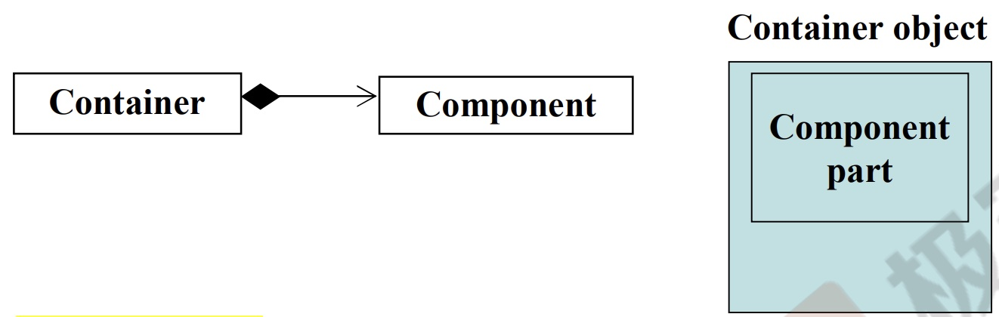
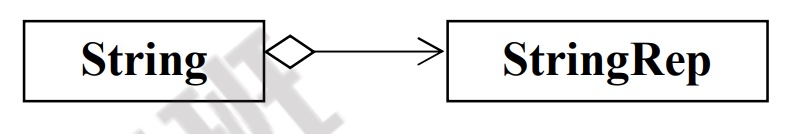
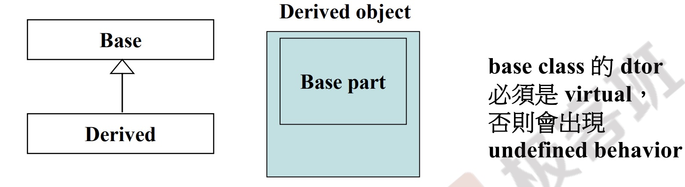
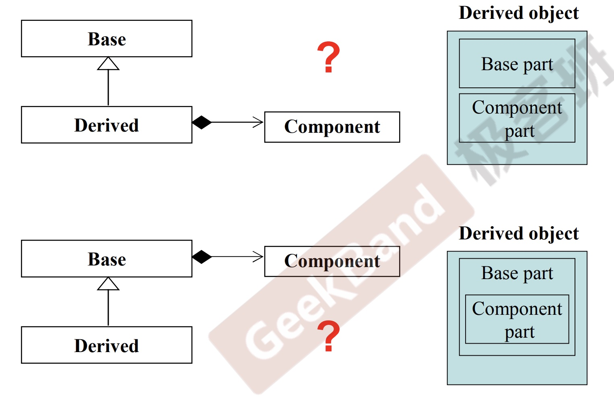

### 知识点1:static

* 修饰普通变量，修改变量的存储区域和生命周期，使变量存储在静态区，在 main 函数运行前就分配了空间，如果有初始值就用初始值初始化它，如果没有初始值系统用默认值初始化它。
* 修饰普通函数，表明函数的作用范围，仅在定义该函数的文件内才能使用。在多人开发项目时，为了防止与他人命名空间里的函数重名，可以将函数定位为 static。
* 修饰成员变量，修饰成员变量使所有的对象只保存一个该变量，而且不需要生成对象就可以访问该成员。
* 修饰成员函数，修饰成员函数使得不需要生成对象就可以访问该函数，但是在 static 函数内不能访问非静态成员。


* static 成员函数中没有this pointer，所以它只能调用static成员函数和static data members.
* static data members要在类体外定义，这样才能给data赋予内存.
* 调用static成员函数有两种方式:
  * 通过object调用
  * 通过class name 调用

```cpp
//普通成员函数的调用实质
{
    Complex c1,c2,c3;
    cout<<c1.real();
    cout<<c2.real();
}

{
    //调用real()的实质
    Complex c1,c2,c3;
    cout<<Complex::real(&c1);
    cout<<Complex::real(&c2);
}
```

```cpp
//static成员函数和static成员变量的使用
class Account{
public:
    static double m_rate;
    static void set_rate(const double& x) { m_rate=x; }
};
//类体外定义赋予变量内存空间
double Account::m_rate=8.0;
int main(){
    //通过class name调用static member funciton
    Account::set_rate(5.0);
    //通过object调用static member function
    Account a;
    a.set_rate(7.0);
}
```

### 知识点2:把构造函数放在private区(单例模式)

```cpp
//方式一(不够完美)
class A{
public:
    static A& getInstancea() {return a; }
    setup() { ... }
private:
    A();
    A(const A& rhs);
    static A a;
}
//调用
int main{
    A::getInstance().setup();
}
```
```cpp
//方式二
class A{
public:
    static A& getInstance();
    setup() { ... }
private:
    A();
    A(const A& rhs);
}
A& A::getInstance(){
    //只有getInstance被调用时才会生成a,且a会一直存在
    static A a;
    return a;
}
//调用
int main{
    A::getInstance().setup();
}
```

### 知识点3:类模板 and 函数模板

```cpp
//类模板
template <typename T>
class complex{
public:
    complex(T r=0,T i=0):re(r),im(i){}
    complex operator+(const complex&);
    T real() const { return re; }
    T imag() const { return im; }
private:
    T re;
    T im;
    friend complex& __doapl(complex*,const complex&);
};
//调用
int main(){
    complex<double> c1(2.5,1.5);
    complex<int> c2(2,6);
}
```

```cpp
class stone{
public:
    stone(int w,int h,int we):_w(w),_h(h),_weight(we){}
    bool operator<(const stone& rhs) const{
        return _weigth<rhs._weight;
    }
private:
    int _w,_h,_weight;
};
//定义函数模板
//class 和typename都可以
template <class T>
inline T& min(const T& a,const T& b){
    return b<a?b:a;
}
//调用
int main(){
    stone r1(2,3),r2(3,3),r3;
    r3=min(r1,r2);  //不需要写成min<stone>,编译器会对function template进行引数推导
}
```

### 知识点4:组合与继承

#### Composition(复合),表示has-a



* Composition:一个类含有另一个类
* Composition的两个类的生命周期同步

* 构造由内而外:Container的构造函数首先**调用Component的default构造函数**,然后才执行自己.
```cpp
Container::Container(...):Component() {...};
```
* 析构由外而内:**Container的析构函数首先执行自己**，然后才调用Component的析构函数.
```cpp
Container::~Container(...) {...; ~Component() };
```

#### Delegation(委托),Composition by reference



* Delegation:两个类通过指针连接
* Delegation的两个类的生命周期不同步

#### Inheritance(继承),表示is-a


```cpp
struct _List_node_base
{
    _List_node_base* _M_next;
    _list_node_base* _M_prev;
};

template<typename _Tp>
struct _List_node:public _List_node_base
{
    _Tp _M_data;
};
```



* 构造和析构的过程和类复合的过程一样
* base class的析构函数必须是virtual,否则会出现undefined behavior


### 知识点5:虚函数与多态

#### Inheritance(继承) with virtual

* non-virtual函数：你不希望子类重新定义(override)它.
* virtual函数：你希望子类重新定义(override)它，且你对它已有默认定义.
* pure virtual函数：你希望子类**一定**要重新定义(override)它，你对它没有默认定义.

```cpp
//例子1
class Shape{
public:
    virtual void draw() const=0;    //pure virtual function
    virtual void error(const std::string& msg); //impure virtual function
    int objectID() const;   //non-virtual
};

class Rectangle:public Shape{...};
class Ellipse:public Shape{...};
```


```cpp
//例子2
#include<iostream>
using namespace std;

class CDocument{
public:
    void OnFileOpen(){
        //这是个算法，每个cout输出代表一个实际动作
        cout<<"dialog..."<<endl;
        cout<<"check file status..."<<endl;
        cout<<"open file..."<<endl;
        Serialize();
        cout<<"close file..."<<endl;
        cout<<"update all views..."<<endl;
    }
    virtual void Serialize() {};
};

class CMyDoc:public CDocument{
public:
    virtual void Serialize(){
        //只有应用程序本身才知道读取自己的文件(格式)
        cout<<"CMyDoc::Serialize()"<<endl;
    }
}

int main(){
    CMyDoc myDoc;
    myDoc.onFileOpen();
}
```

#### 继承+复合关系下的构造和析构




